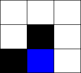
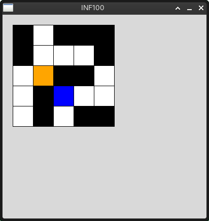

## Del 1: Sette opp miljøet

Miljøet i vårt tilfelle er en labyrint. Labyrinten skal representeres ved hjelp av en 2D-liste med heltallsverdier. En **åpen rute** (hvor agenten vår kan gå) representeres av tallet `0`. En **veggrute** (hvor agenten vår *ikke* kan gå) representeres av tallet `1`. En **målrute** (hvor agenten vår ønsker å komme til) representeres av tallet `2`. 

For eksempel, 2D-listen `[[0, 0, 0], [0, 1, 0], [1, 2, 0]]` representerer denne labyrinten:



---

### 1.a Les labyrint fra fil 
Lag en funksjon `load_maze_from_file(filename)` i `maze.py` som åpner en tekstfil, leser innholdet, og returnerer en 2D-liste som representerer labyrinten. For eksempel, hvis vi har en tekstfil `maze.txt` med følgende innhold: 

```
0001
1121
0100
0001
```

så skal `load_maze_from_file("maze.txt")` returnere følgende 2D-liste:

```python
[[0, 0, 0, 1],
 [1, 1, 2, 1], 
 [0, 1, 0, 0],
 [0, 0, 0, 1]]
```

Til slutt skal vi utvide funksjonen vår til å legge til en kant med veggruter (1ere) rundt labyrinten. Med andre ord, legg til 1ere på begynnelsen og slutten av hver rad, og legg til en rad med bare 1ere på toppen og bunnen. Med samme `maze.txt` som i eksempelet ovenfor skal nå `load_maze_from_file("maze.txt")` nå returnere følgende 2D-liste:

```python
[[1, 1, 1, 1, 1, 1],
 [1, 0, 0, 0, 1, 1], 
 [1, 1, 1, 2, 1, 1], 
 [1, 0, 1, 0, 0, 1], 
 [1, 0, 0, 0, 1, 1], 
 [1, 1, 1, 1, 1, 1]]
```

Du kan laste ned filen [`maze.txt`](./maze.txt) eller lage din egen. Hvis du velger å lage din egen labyrint, sørg for at labyrinten er løsbar fra alle mulige startposisjoner for agenten. Fram til du vet at programmet ditt fungerer som det skal, prøv å ikke lag labyrinten alt for stor (det blir vanskeligere for agenten å lære).

Gå videre til neste deloppgave når du har testet funksjonen din og er overbevist om at den fungerer korrekt.

<details>
  <summary><b>&#128161; Hint</b></summary>

  - Bruk `with open(filename, "r") as f:` når du skal lese tekstfilen.
  - Iterer over linjene i filen ved å bruke `readlines()`. For eksempel: `for line in f.readlines():`.
  - Du kan bruke `+` til å sette sammen lister. For eksempel: `[1] + [1, 0, 1] + [0]` gir listen `[1, 1, 0, 1, 0]` og `[[1, 1]] + [[1, 0], [0, 1]] + [[0, 0]]` gir listen `[[1, 1], [1, 0], [0, 1], [0, 0]]`.

</details>

<details>
  <summary><b>&#129528; Løsningsforslag</b></summary>
  
```python
def load_maze_from_file(filename):
    maze = []
    with open(filename, "r") as f:
        for line in f.readlines():
            maze.append([1] + list(map(int, line.strip())) + [1])

    full_row = [[1] * len(maze[0])]
    return full_row + maze + full_row
```

</details>

---

### 1.b Tegn labyrinten 
I filen `maze.py`, definer en ny funksjon `draw_maze(canvas, maze, x1, y1, x2, y2, agent_pos)` som tegner labyrinten `maze` på `canvas`. 

- Parameteren `canvas` er canvas-objektet (som vi senere importerer fra `uib_inf100_graphics`) som vi skal tegne på.
- Parameteren `maze` er en 2D-liste som representerer labyrinten (formatet som `load_maze_from_file` returnerer).
- Punktene `(x1, y1)` og `(x2, y2)` (alle heltall) er koordinatene til henholdsvis øvre venstre hjørne og nedre høyre hjørne av labyrinten. 
- Parameteren `agent_pos` er en tupel av heltall `(x, y)` som angir agentens posisjon i labyrinten (NB: Her er `y` rad-indeks og `x` kolonne-indeks i `maze` og *ikke* koordinater på `canvas`!).

Bruk følgende fyllfarger for de forskjellige rutetypene (og ruten agenten befinner seg i):
- Åpen rute: Hvit. 
- Veggrute: Svart.
- Målrute: Blå.
- Agentens rute: Oransje.

&#128203; **Test implementasjonen din:** For å teste funksjonen `draw_maze` som du har laget, lagre filen [`test_draw_maze.py`](./tests/test_draw_maze.py) i samme mappe som de andre filene. Når du kjører `test_draw_maze.py` skal du få opp et vindu som ser slik ut:



Hvis du får opp et vindu helt likt som det i bildet ovenfor kan du gå videre.

<details>
  <summary><b>&#128161; Hint</b></summary>
  
- Regn ut hvor mange rader og kolonner vi har og bruk dette til å regne ut høyden og bredden til hver rute i labyrinten.
- Bruk en nøstet for-løkke når du tegner rutene.
- For å tegne en rute på `canvas`, bruk funksjonen `canvas.create_rectangle(left, top, right, bottom, fill)` fra `uib_inf100_graphics`.
- Bruk verdien av `maze[i][j]` for å bestemme fargen ruten skal ha.

</details>

<details>
  <summary><b>&#129528; Løsningsforslag</b></summary>
  
```python
def draw_maze(canvas, maze, x1, y1, x2, y2, agent_pos):
    n_row, n_col = len(maze), len(maze[0])
    dx, dy = (x2 - x1) / n_col, (y2 - y1) / n_row

    for i in range(n_row):
        for j in range(n_col):
            top = y1 + dy * i
            left = x1 + dx * j
            bottom = top + dy
            right = left + dx

            if maze[i][j] == 1:
                fill = "black"
            elif maze[i][j] == 2:
                fill = "blue"
            else:
                fill = "white"

            if (j, i) == agent_pos:
                fill = "orange"

            canvas.create_rectangle(left, top, right, bottom, fill=fill)
```
</details>

---

### 1.c Finn en tilfeldig åpen rute

Lag en funksjon `get_random_position(maze)` i filen `maze.py` som returnerer en tupel `(x, y)` med posisjonen til en tilfeldig åpen rute i labyrinten gitt som parametren `maze`. NB: `x` er kolonne-indeks og `y` er rad-indeks slik at rutetypen i posisjon `(x, y)` bestemmes av verdien `maze[y][x]`.

For eksempel, hvis `maze` er 2D-listen
```python
[[1, 0, 2],
 [0, 1, 0],
 [1, 0, 0]]
```
så skal `get_random_position(maze)` returnere *én* av følgende tupler: `(1, 0)`, `(0, 1)`, `(2, 1)`, `(1, 2)` eller `(2, 2)`.

<details>
  <summary><b>&#128161; Hint</b></summary>
  
  - Importer `random` ved å legge til `import random` i begynnelsen av `maze.py`.
  - Bruk `random.randrange(a, b)` for å få et tilfeldig heltall mellom `a` og `b - 1`.
  - Bruk en while-løkke og returner når du finner en åpen rute.

</details>

<details>
  <summary><b>&#129528; Løsningsforslag</b></summary>

```python
def get_random_position(maze):
    n_row, n_col = len(maze), len(maze[0])
    while True:
        x, y = random.randrange(0, n_col), random.randrange(0, n_row)
        if maze[y][x] == 0:
            return (x, y)
```
 
</details>

---

### 1.d Sjekk rutetype

I filen `maze.py`, lag to funksjoner `is_wall(maze, pos)` og `is_goal(maze, pos)` som henholdsvis sjekker om ruten i posisjon `pos` er en veggrute eller målrute. Parameteren `maze` er labyrinten gitt som en 2D-liste og parameteren `pos` er en tupel av heltall `(x, y)` som angir ruten vi vil sjekke. Funksjonen `is_wall(maze, pos)` skal returnere `True` hvis ruten i posisjon `pos` er en veggrute (har verdi `1`), og `False` ellers. Funksjonen `is_goal(maze, pos)` skal returnere `True` hvis ruten i posisjon `pos` er en målrute (har verdi `2`), og `False` ellers.

<details>
  <summary><b>&#128161; Hint</b></summary>

  - Pakk ut tupelen `pos` som `x, y = pos` og sjekk verdien av `maze[y][x]`.

</details>

&#128203; **Test implementasjonen din:** Lagre filen [`test_is_wall_and_is_goal.py`](./tests/test_is_wall_and_is_goal.py) i samme mappe som de andre filene og kjør den for å teste koden din. Hvis du får `All test passed!` kan du gå videre.

<details>
  <summary><b>&#129528; Løsningsforslag</b></summary>

```python
def is_wall(maze, pos):
    x, y = pos
    return maze[y][x] == 1

def is_goal(maze, pos):
    x, y = pos
    return maze[y][x] == 2
```
  
</details>

---

### 1.e Finn koordinater til naborute

Lag en funksjon `coord_in_direction(pos, direction)` i filen `maze.py`. Funksjonen tar in en tupel `pos` av heltall på formen `(x, y)` og en streng `direction` som tar en av følgende verdier: `"left"`, `"right"`, `"up"` eller `"down"`. Funksjonen skal returnere en posisjonen til ruten i retning `direction`.

For eksempel, `coord_in_direction((1, 1), "up")` skal returnere `(1, 0)` og `coord_in_direction((1, 1), "left")` skal returnere `(0, 1)`.

Du skal ikke sjekke om den nye posisjonen er en veggrute eller utenfor brettet.

<details>
  <summary><b>&#128161; Hint</b></summary>

  - Pakk ut tupelen `pos` som `x, y = pos`.
  - Koordinatene for ruten til venstre blir `(x - 1, y)`.
  - Koordinatene for ruten til høyre blir `(x + 1, y)`.
  - Koordinatene for ruten over blir `(x, y - 1)`.
  - Koordinatene for ruten under blir `(x, y + 1)`.

</details>

&#128203; **Test implementasjonen din:** Lagre filen [`test_coord_in_direction.py`](./tests/test_coord_in_direction.py) i samme mappe som de andre filene og kjør den for å teste koden din. Hvis du får `All test passed!` kan du gå videre.

<details>
  <summary><b>&#129528; Løsningsforslag</b></summary>

```python
def coord_in_direction(pos, direction):
    x, y = pos
    if direction == "left":
        return (x - 1, y)
    if direction == "right":
        return (x + 1, y)
    if direction == "up":
        return (x, y - 1)
    if direction == "down":
        return (x, y + 1)
    return pos
```
  
</details> 

---

### 1.f Flytt agenten

Lag en funksjon `move_agent(agent_pos, direction, maze)` i filen `maze.py` som returnerer agentens nye posisjon dersom agenten er i `agent_pos` og beveger seg i retning `direction`. Parameteren `agent_pos` er igjen en tupel med heltall på formen `(x, y)`. Parameteren `direction` er en streng som har en av følgende verdier: `"left"`, `"right"`, `"up"` eller `"down"`. Parameteren `maze` er en 2D-liste som representerer labyrinten. Hvis agenten prøver å gå inn i en vegg, returner `agent_pos`. Ellers, returner koordinatene til den nye posisjonen.


<details>
  <summary><b>&#128161; Hint</b></summary>

  - Bruk `coord_in_direction` for å finne koordinatene til ruten i retning `direction` fra `agent_pos`.
  - Bruk `is_wall` for å sjekke om naboruten er en vegg.
  - Du kan bruke "early return" for å gjøre koden din lettere å lese. For eksempel funksjonen `foo(bar)` nedenfor returnerer 1 hvis bar har verdien "hello", 2 hvis bar har verdien "world" og 0 ellers.

```python
def foo(bar):
    if bar == "hello":
        return 1
    if bar == "world":
        return 2
    return 0
```

</details>

&#128203; **Test implementasjonen din:** Lagre filen [`test_move_agent.py`](./tests/test_move_agent.py) i samme mappe som de andre filene og kjør den for å teste koden din. Hvis du får `All test passed!` kan du gå videre.

<details>
  <summary><b>&#129528; Løsningsforslag</b></summary>

```python
def move_agent(agent_pos, direction, maze):
    next_pos = coord_in_direction(agent_pos, direction)
    if is_wall(maze, next_pos):
        return agent_pos
    return next_pos
```
 
</details>

---

[Trykk her for å komme til del 2.](./part_2.md)
